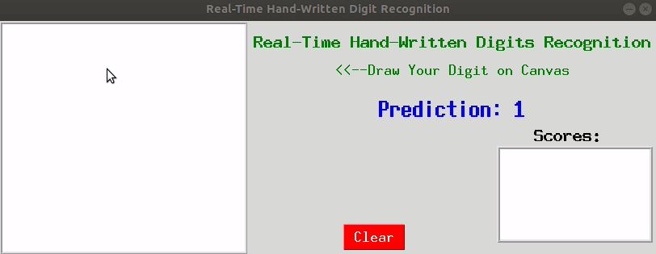

# GUI for Hand-Written Digit Recognition
This is the first GUI interactive project that I build to integrate machine learning model in Python. The GUI is meant to predict our digit hand-writting as soon as we finish writting digit using mouse in canvas. The scores box on the lower right-hand side showing the probability of each digit, with the highest probability is used as our prediction.

## How To Use? 
Please see the GIF below

